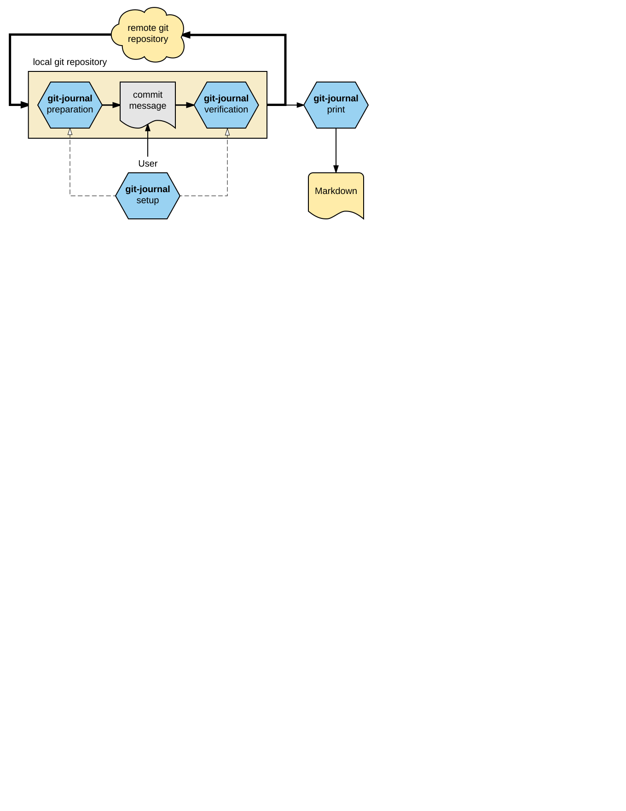

# [git-journal 📖](https://saschagrunert.github.io/git-journal) [](https://github.com/saschagrunert/git-journal/blob/master/LICENSE) [](https://travis-ci.org/saschagrunert/git-journal)  [](https://coveralls.io/github/saschagrunert/git-journal?branch=master)
## The Git Commit Message and Changelog Generation Framework

Table of contents:

* [TL;DR](#tldr)
* [Installation](#installation)
* [Usage](#usage)
    * [Default output](#default-output)
    * [Template output](#template-output)
    * [Commit message preparation and verification](#commit-message-preparation-and-verification)
* [Current Features](#current-features)
* [Planned features and improvements](#planned-features-and-improvements)
* [Contributing](#contributing)

---

## TL;DR
[tldr]: #tldr

Target of the project is to provide a framework to write more sensible commit messages for the
[git scm](https://git-scm.com/). Single commit messages should contain one logical change of the project which is
described in a standardized way. This results in a much cleaner git history and provides contributors more information
about the actual change.

Furthermore it should be easier to generate nice looking changelogs directly from your commit history. This is where
_git-journal_ solves common problems.

Two RFCs, one for a
[commit message syntax extension](https://github.com/saschagrunert/git-journal/blob/master/rfc/0001-commit-msg.md)
and another for the
[output templating engine](https://github.com/saschagrunert/git-journal/blob/master/rfc/0002-output-templating.md)
is the base for this.

## Installation
[installation]: #installation

To use _git-journal_ as a git extension a [Rust installation](https://www.rust-lang.org/en-US/downloads.html) is needed
including the package manager [cargo](https://crates.io/install). Different package managers will provide these as well,
for example via [Pacman](https://wiki.archlinux.de/title/pacman) on Arch Linux:

```terminal
sudo pacman -S rust cargo
```

Once these two dependencies are installed, _git-journal_ can be installed via:

```terminal
cargo install git-journal
```

After adapting your `$PATH` variable to search also within `~/.cargo/bin` it should be possible to run it by invoking
`git journal`.

## Usage
[usage]: #usage

The binary `git-journal` depends on the Rust library `gitjournal`, which also can be used independently from the binary
application to write customized solutions. [This repository](https://github.com/saschagrunert/test) will be used as an
example for the following explanations.

### Default output
[defaultoutput]: #defaultoutput

If you run `git journal` anywhere inside this repository, the output will be a nice looking
[Markdown](https://en.wikipedia.org/wiki/Markdown) formatted changelog based on your repositories git log:

```terminal
> git journal
[git-journal] [INFO] Skipping commit: Summary parsing: 'Merge branch 'test_branch''
[git-journal] [OKAY] Parsing done.

# Unreleased (2016-09-18):
- [Added] file4 again
    This paragraph explains the change in detail
    - [Fixed] multiple issues
    - [Removed] not needed things
- [Removed] file4.txt
- [Added] file4.txt
- [Added] file1.txt again
- [Removed] file1.txt

# v2 (2016-09-12):
- [Added] file3.txt
```

All commits are sorted by time, which means that the newest elements occur at the top. The parsing of the commit message
will be done regarding [RFC0001](https://github.com/saschagrunert/git-journal/blob/master/rfc/0001-commit-msg.md), which
describes the different syntax elements within a commit message. Categories (`[Added]`, `[Fixed]`, ...) are
automatically wrapped in square brackets if available. The journal automatically lists the log from the last release and
the unreleased entries. It is also possible to skip the unreleased entries:

```terminal
> git journal -u
[git-journal] [OKAY] Parsing done.

# v2 (2016-09-12):
- [Added] file3.txt
```

Using a specific commit range in the format `REV..REV` or a different starting point than `HEAD` for parsing can also
be done:

```terminal
> git journal v1
> git journal v2
> git journal v1...HEAD^
```

It is also possible to print all releases (git tags) with `-a`, the past `n` releases via `-n <COUNT>`:

```terminal
> git journal -a
[git-journal] [INFO] Skipping commit: Summary parsing: 'Merge branch 'test_branch''
[git-journal] [OKAY] Parsing done.

# Unreleased (2016-09-18):
- [Added] file4 again
    This paragraph explains the change in detail
    - [Fixed] multiple issues
    - [Removed] not needed things
- [Removed] file4.txt
- [Added] file4.txt
- [Added] file1.txt again
- [Removed] file1.txt

# v2 (2016-09-12):
- [Added] file3.txt

# v1 (2016-09-12):
- [Added] file2.txt
- [Added] file1.txt
```

```terminal
> git journal -un1
[git-journal] [OKAY] Parsing done.

# v2 (2016-09-12):
- [Added] file3.txt
```

Beside the usual detailed log a short version (`-s`) exists, which just uses the commit summary:

```terminal
> git journal -as
[git-journal] [INFO] Skipping commit: Summary parsing: 'Merge branch 'test_branch''
[git-journal] [OKAY] Parsing done.

# Unreleased (2016-09-18):
- [Added] file4 again
- [Removed] file4.txt
- [Added] file4.txt
- [Added] file1.txt again
- [Removed] file1.txt

# v2 (2016-09-12):
- [Added] file3.txt

# v1 (2016-09-12):
- [Added] file2.txt
- [Added] file1.txt
```

It also possible to append the output of the journal to a file (`-o`), which will be separated by a newline (`---`) for
each git journal invocation. Git tags with a specific patterns like `rc` will be excluded automatically, which can be
customized via `-e`.

For more information please refer to the help `git journal -h`.

### Template output
[templateoutput]: #templateoutput

The design of commit message templates is described in
[RFC0002](https://github.com/saschagrunert/git-journal/blob/master/rfc/0002-output-templating.md). From now on we are
using this template for the test repository:

```toml
[default]

[tag1]
name = "Section 1"

[tag1.tag2]
```

To use such a template just use the `-t` option:

```terminal
> git journal -t CHANGELOG.toml
[git-journal] [INFO] Skipping commit: Summary parsing: 'Merge branch 'test_branch''
[git-journal] [OKAY] Parsing done.

# Unreleased (2016-09-18):
## default
- [Removed] not needed things
- [Removed] file4.txt
- [Added] file4.txt
- [Added] file1.txt again
- [Removed] file1.txt

## Section 1
- [Added] file4 again
- This paragraph explains the change in detail

### tag2
- [Fixed] multiple issues


# v2 (2016-09-12):
## default
- [Added] file3.txt
```

Everything which is untagged will go into the `default` section. The name of `tag1` will be mapped to `Section 1` and
`tag2` is a subtag of `tag1` (see the markdown header). This also means that it is now possible that list items are
uncategorized since the templating engine gives the possibility to split commits into multiple pieces. Parsed paragraphs
are converted to single list items to always provide a clean markdown. The command line options like in the default
output are available as well.

### Commit message preparation and verification
[prepverify]: #prepverify

To use the automatic commit message preparation and verification the git journal setup has to be executed on every local
repository:

```terminal
> git journal setup
[git-journal] [OKAY] Defaults written to '.gitjournal.toml' file.
[git-journal] [OKAY] Git hook installed to '.git/hooks/commit-msg'.
[git-journal] [OKAY] Git hook installed to '.git/hooks/prepare-commit-msg'.
[git-journal] [OKAY] Installed bash completions to your current working path.
[git-journal] [OKAY] Installed fish completions to your current working path.
```

If there already exists these hooks _git-journal_ tries to append the needed commands, which has to be verified by hand
afterwards. The generated command line completions for bash and fish needs to be put in the correct directory of your
shell. The default configuration file is a [toml](https://github.com/toml-lang/toml) file which represents
[this structure](https://saschagrunert.github.io/git-journal/gitjournal/config/struct.Config.html). A default
configuration with comments can also be
[found here](https://saschagrunert.github.io/git-journal/gitjournal/struct.GitJournal.html#examples-1).

If the setup is done _git-journal_ will verify your inserted commit message as well as doing a preparation. For example,
if we are now trying to commit something which can not be parsed:

```terminal
> touch my_file
> git add my_file
> git commit -m "This commit contains no cactegory"
[git-journal] [ERROR] Commit message preparation failed: GitJournal: Parser: Summary parsing: 'This commit contains no cactegory'
```

Since we are using the `-m` flag there is no chance for the user to edit the message any more and _git-journal_ will
reject it. If we are using a commit message editor via the usual `git commit` without the `-m` we will get a default
commit message template:

```terminal
JIRA-1234 Added ...

# Add a more detailed description if needed

# - Added ...
# - Changed ...
# - Fixed ...
# - Improved ...
# - Removed ...
```

The `JIRA-1234` prefix is just the default and can be configured via the `.gitjournal.toml` file. If the submitted
commit message is also invalid we will get an error like this:

```terminal
[git-journal] [ERROR] Commit message invalid: GitJournal: Parser: Summary parsing: 'This commit message is also invalid'
```

If everything went fine it should look like this:
```terminal
> git commit -m "Added my_file"
[git-journal] [OKAY] Commit message prepared.
[git-journal] [OKAY] Commit message valid.
[master 1b1fcad] Added my_file
 1 file changed, 0 insertions(+), 0 deletions(-)
 create mode 100644 my_file
```

This means in detail that _git-journal_ will build up two gates (one for preparation and one for verification) during
doing the commit by the user. This graphic will sum up where _git-journal_ will take influence on the local git
repository:


## Current Features
[features]: #features

* General
    * [x] Generation of completions for bash and fish shell during setup.
* Journal generation and output
    * [x] Automatic up-level repository search if a sub path of a git repository was specified.
    * [x] Custom commit ranges or different git commit starting points for parsing.
    * [x] Run in a different specified path than the current working directory (`-p`).
    * [x] Parse and print the complete history (`-a`) or the past `n` releases (`-n`).
    * [x] Print a short version of the commit history based on the commit message summary (`-s`).
    * [x] Output the parsed log in valid Markdown to the command line or a file (`-o`).
    * [x] Custom git tag exclude pattern, e.g. `rc` tags (`-e`).
    * [x] Enable/Disable debug message output.
    * [x] Enable/Disable colored output via the command line.
    * [x] Automatic wrapping of commit message categories in square brackets.
    * [x] Templating support including tag and name mapping.
* Preparation and Verification of commit messages
    * [x] Automatic installation of git hooks inside the local repository.
    * [x] Generation of default configuration file during setup.
    * [x] Commit message validation based on implemented parser.
    * [x] Message preparation with custom commit prefix (config) and differentiation between amended and new commits

## Planned features and improvements
[planned]: #planned

* [ ] Multi threading support for parsing.
* [ ] Custom category support.
* [ ] Custom commit message template support, which will be used for commit preparation.
* [ ] Multiple template extensions, like custom header/footer or other different custom fields.
* [ ] Generation of default templates based on commits within a given commit rage.
* [ ] Custom sorting methods for the default and template based output.
* [ ] Commit message validation via provided template

## Contributing
[contributing]: #contributing

You want to contribute to this project? Wow, thanks! So please just fork it and send me a pull request.
